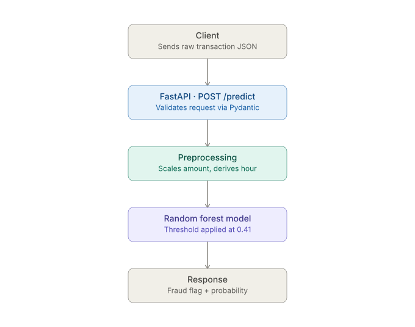

# Fraud Detection System


A credit card fraud detection system: a Random Forest classifier trained on transaction data, served through a FastAPI wrapper and deployed on AWS EC2.

**Live:** http://52.3.144.8:8000 (interactive docs at [`/docs`](http://52.3.144.8:8000/docs))
(*Demo instance, may be offline.*)

## The problem

Credit card fraud detection is a classification problem with severe class imbalance. In this dataset, fraud makes up **0.173%** of transactions (492 out of 284,807). A model that just predicts "not fraud" every time would be 99.8% accurate and completely useless. The real challenge isn't accuracy, it's finding a small number of fraud cases in a huge pile of legitimate ones, without generating so many false alarms that the system becomes unusable.

## Dataset

[Kaggle Credit Card Fraud Detection dataset](https://www.kaggle.com/datasets/mlg-ulb/creditcardfraud): 284,807 transactions, 31 columns. `V1`–`V28` are PCA-transformed features (anonymized for privacy), plus `Time`, `Amount`, and the `Class` label. The raw CSV isn't included in this repo (it's ~150MB and the dataset's license doesn't cover redistribution). You can download it from Kaggle and place it at `data/creditcard.csv` to reproduce the notebooks.

## Approach

**Feature engineering:** `Time` (seconds since first transaction) carries no real signal on its own, so it's dropped in favor of a derived `Hour` (0–23) feature, which shows a mild but real difference between fraud and legitimate transactions. `Amount` is scaled with `StandardScaler` fit on the training set only.

**Imbalance handling:** Class weighting (`class_weight='balanced'`) rather than SMOTE to avoid synthetic data artifacts in a high-dimensional PCA space where interpolation between points is hard to reason about.

**Model:** Random Forest was chosen over Logistic Regression because fraud signal here depends on non-linear relationships between PCA components, which a linear model can't capture. The decision threshold was tuned from the default 0.5 down to **0.41**, the edge of the precision-recall curve's flat plateau, trading a small amount of precision for better recall.

**Evaluation:** PR-AUC, not ROC-AUC, is the headline metric. Under this level of class imbalance, ROC-AUC is inflated by the huge number of true negatives and doesn't reflect real-world usefulness.

Full reasoning for every decision above, including what was tried and rejected, is in [`docs/model_comparison.md`](docs/model_comparison.md).

## Results

| Metric | Value |
|---|---|
| Precision | 0.95 |
| Recall | 0.80 |
| PR-AUC | 0.86 |
| ROC-AUC | 0.953 |
| False positives (test set) | 4 out of 56,864 legitimate transactions |
| False negatives (test set) | 20 out of 98 fraud cases |
| Prediction latency (p95) | 29 ms |

Also benchmarked against XGBoost (marginally better, not deployed, see comparison doc for why) and Isolation Forest (unsupervised, notably worse, confirms this problem benefits from labeled data rather than pure anomaly detection).

## API

The trained model is served through a FastAPI app (`src/main.py`). It accepts a raw transaction (`Time`, `Amount`, `V1`–`V28`), replicates the training-time preprocessing internally (scaling, hour derivation), and returns a fraud prediction using the tuned 0.41 threshold and not the model's default.

**Endpoints:**
- `GET /` for health check
- `POST /predict` to score a transaction

Example request against the live instance:

```bash
curl -X POST http://52.3.144.8:8000/predict \
  -H "Content-Type: application/json" \
  -d '{"Time": 406.0, "Amount": 9.99,
       "V1": -2.3122, "V2": 1.9519, "V3": -1.6098, "V4": 3.9979,
       "V5": -0.5222, "V6": -1.4265, "V7": -2.5373, "V8": 1.3916,
       "V9": -2.7700, "V10": -2.7722, "V11": 3.2020, "V12": -2.8999,
       "V13": -0.5952, "V14": -4.2892, "V15": 0.3898, "V16": -1.1407,
       "V17": -2.8300, "V18": -0.0168, "V19": 0.4169, "V20": 0.1269,
       "V21": 0.5172, "V22": -0.0350, "V23": -0.4652, "V24": 0.3202,
       "V25": 0.0445, "V26": 0.1780, "V27": 0.2611, "V28": -0.1433}'
```

This is a known fraud case from the test set. Expected response:

```json
{"is_fraud": true, "fraud_probability": 0.58, "threshold_used": 0.41}
```



### Deployment

Running on an AWS EC2 instance (Ubuntu 24.04, t3.micro) managed by systemd, so the service survives disconnects and restarts automatically on failure or reboot. `scikit-learn` is pinned to 1.6.1 to match the version the model was trained under, which keeps the serving environment consistent with the one the model was trained and validated in.

### Running locally

```bash
git clone https://github.com/ArpanGoyal09/Fraud-Detection-System.git
cd Fraud-Detection-System
python -m venv venv
source venv/bin/activate      # macOS / Linux
venv\Scripts\activate         # Windows
pip install -r requirements-dev.txt
uvicorn src.main:app --reload
```
`requirements.txt` holds runtime dependencies only; `requirements-dev.txt` adds testing and experimentation packages (pytest, XGBoost) on top. The deployed instance installs only the runtime set.

Then open `http://127.0.0.1:8000/docs` for an interactive test page, or run the automated tests:

```bash
pytest tests/ -v
```

## Project structure

```
├── data/                 # dataset (gitignored)
├── docs/                 # model comparison writeup and reasoning
├── models/               # trained model + scaler artifacts
├── notebooks/            # EDA, training, and model comparison scripts
├── src/                  # FastAPI application
│   ├── main.py           # API endpoints
│   ├── preprocessing.py  # feature engineering pipeline (mirrors training)
│   └── schemas.py        # request/response validation
└── tests/                # automated API tests
```

## Limitations

- **`V1`–`V28` are specific to this dataset's PCA transformation** and aren't transferable to other fraud datasets because a different dataset's anonymized features, even if similarly named, would represent a different underlying transformation and can't be validly scored by this model.
- Served over plain HTTP with no TLS, authentication, or rate limiting. Fine for a demo endpoint, not something that should handle real transaction data.
- Trained on data from a fixed time window; a production system would need to handle model drift as fraud patterns evolve over time.
